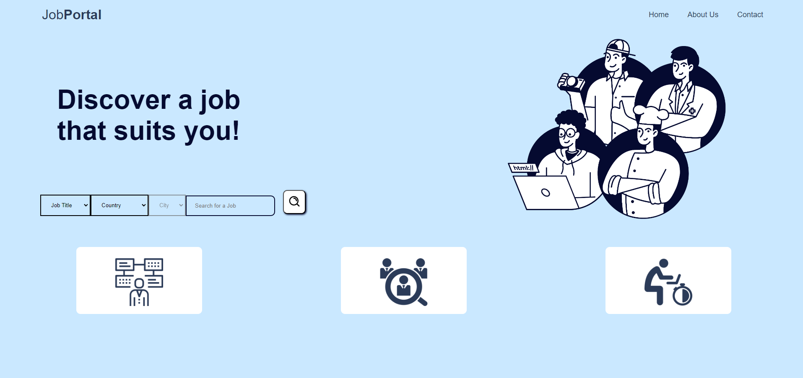

# JobPortal

## Brief description of the project
The job search process can often be daunting and time-consuming, with job seekers sifting through countless listings to find positions that match their skills and preferences. Recognizing this challenge, we identified a pressing need for a more efficient and user-centric job search solution. This motivation drove us to develop JobPortal, a platform designed to address these pain points and streamline the job search experience. JobPortal aims to provide a platform that is easy to navigate, where users can efficiently tailor their search results based on job type, location, and salary range. This personalized approach enhances the user experience and increases the likelihood of finding suitable job matches.

## Frontend mockup

## Installation details
1. **Clone the repository:**

    git clone https://github.com/yourusername/jobportal.git
    cd jobportal

2. **Create and activate a virtual environment (optional):**

    python3 -m venv venv
    source venv/bin/activate  # On Windows use `venv\Scripts\activate`

3. **Install the required packages:**

    pip install -r requirements.txt

4. **Run the migrations:**

    python manage.py migrate

5. **Run the development server:**

    python manage.py runserver

6. **Open the application in your browser:**

    http://127.0.0.1:8000/

## Architecture
- **Frontend:** HTML/CSS/JavaScript
- **Backend:** Django (Python)
- **API:** Google Jobs API

### High level structure of the repo
jobportal/
├── final_app/
│ ├── pycache/
│ ├──├── __pycache__
│ ├──├──├── ... Django files ...
│ ├── migrations/
│ ├──├── __pycache__
│ ├──├──├── ... Django files ...
│ ├── static/
│ ├──├── scripts/
│ ├──├──├── script.js
│ ├──├── ... Pictures ...
│ ├── templates/
│ ├──├── about.html
│ ├──├── base.html
│ ├──├── contact.html
│ ├──├── home.html
│ ├──├── results.html
│ ├── init.py
│ ├── admin.py
│ ├── api.py
│ ├── apps.py
│ ├── models.py
│ ├── tests.py
│ ├── urls.py
│ └── views.py
├── final_project/
│ ├── pycache/
│ ├──├── ... Django files ...
│ ├── init.py
│ ├── asgi.py
│ ├── settings.py
│ ├── urls.py
│ ├── wsgi.py
│ ├── db.sqlite3
│ └── manage.py
├── .vscode/
│ └── launch.json
└── README.md
